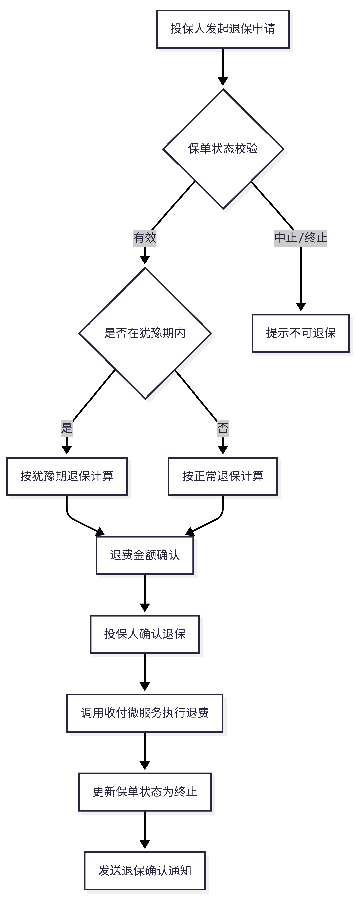

| 文档编号 | REQ-2026-05-001 | 版本   | V1.0       |
| ---- | --------------- | ---- | ---------- |
| 编写人  | 产品部-张三          | 编写日期 | 2026-05-22 |
| 审核人  | 技术部-李四          | 状态   | 评审中        |

# 1. 需求背景

## 1.1 业务现状

目前公司网销渠道（官方APP、微信小程序）的退保业务仍依赖线下柜面办理，投保人需携带身份证件前往柜台填写退保申请书，由柜员手工录入系统后发起退保流程。该模式存在以下问题：

- 客户体验差：投保人须在工作时间前往柜面，排队等候时间长

- 运营成本高：每笔退保需柜员人工处理，人力成本持续上升

- 时效不可控：柜面受理后还需流转至保全岗审核，全流程平均耗时5个工作日

## 1.2 需求目标

实现网销渠道退保全流程线上化，投保人通过APP或小程序即可自助完成退保申请，系统自动完成身份校验、退费金额计算和退费执行，将退保处理时效从5个工作日缩短至实时处理。

# 2. 业务流程

## 2.1 整体流程

退保业务的整体流程如下图所示：

## 2.2 犹豫期退保规则

投保人签收电子保单后15天内为犹豫期。犹豫期内申请退保的，退费金额计算公式为：

退费金额 = 已缴保费 - 工本费（不超过10元）

犹豫期退保的退费须在受理后5个工作日内完成，退费至投保人原缴费账户。

## 2.3 正常退保规则

超过犹豫期后的退保，退还保单的现金价值。现金价值根据保单已生效年限、已缴保费总额、险种类型等因素计算，具体金额参见产品条款中的现金价值表。业务人员须向投保人充分告知退保损失。

如保单存在保单贷款未还清的情况，退费金额须先扣除贷款本息。

# 3. 功能需求

## 3.1 退保申请

投保人通过APP或小程序提交退保申请，系统须完成以下校验：

| 序号  | 校验项   | 校验规则              | 不通过处理         |
| --- | ----- | ----------------- | ------------- |
| 1   | 保单状态  | 保单必须为有效状态         | 提示：保单当前状态不可退保 |
| 2   | 申请人身份 | 申请人须为投保人本人        | 提示：仅投保人可申请退保  |
| 3   | 犹豫期判断 | 判断当前是否在犹豫期内       | 按对应规则计算退费金额   |
| 4   | 保单贷款  | 检查是否存在未还清的保单贷款    | 退费金额先扣除贷款本息   |
| 5   | 受益人同意 | 含身故受益人的保单须所有受益人同意 | 提示：请联系受益人确认   |
| 6   | 反洗钱校验 | 退保金额超过5万元触发身份重新识别 | 引导投保人完成身份核验   |

## 3.2 退费计算

系统须根据退保类型自动计算退费金额：

| 退保类型   | 退费公式                | 退费时效         |
|------------|-------------------------|------------------|
| 犹豫期退保 | 已缴保费 - 工本费       | 受理后5个工作日  |
| 正常退保   | 现金价值 - 保单贷款本息 | 受理后10个工作日 |

## 3.3 通知机制

退保完成后系统须向投保人发送以下通知：

| 通知节点     | 通知方式     | 通知内容                                  |
|--------------|--------------|-------------------------------------------|
| 退保申请受理 | APP推送+短信 | 您的退保申请已受理，预计X个工作日完成退费 |
| 退费执行成功 | APP推送+短信 | 退费金额XX元已退还至您的XX账户            |
| 退保完成     | APP推送+短信 | 您的保单已退保终止，如需保障请重新投保    |

# 4. 非功能需求

## 4.1 性能要求

- 退保申请接口响应时间不超过3秒

- 退费执行接口响应时间不超过5秒

- 系统须支持日均5000笔退保申请的并发处理

## 4.2 安全要求

- 退保操作须进行投保人身份二次验证（短信验证码或人脸识别）

- 退保金额超过5万元须触发反洗钱客户身份重新识别

- 退保操作日志须完整记录，保留期不少于10年

# 5. 数据要求

退保操作涉及的数据字段及存储结构详见附件A《退保数据字典》。退保相关的微服务接口定义详见附件B《退保接口规范》。

# 6. 验收标准

| 编号  | 验收项     | 验收标准                                           |
|-------|------------|----------------------------------------------------|
| AC-01 | 犹豫期退保 | 投保人在犹豫期内退保，退费金额等于已缴保费减工本费 |
| AC-02 | 正常退保   | 超过犹豫期退保，退费金额等于保单现金价值           |
| AC-03 | 退费时效   | 退费在受理后规定工作日内到达投保人账户             |
| AC-04 | 通知送达   | 退保各节点通知通过APP推送和短信送达投保人          |
| AC-05 | 保单状态   | 退保完成后保单状态变更为终止                       |
| AC-06 | 异常处理   | 退费失败时系统自动重试并通知运维人员               |

# 7 附件

附件A：退保短信模板与通知渠道配置说明

[[网销渠道退保功能需求规格说明书_files/attachments/退保短信模板与通知渠道配置说明]]

附件B：退保数据字典

[[网销渠道退保功能需求规格说明书_files/attachments/退保数据字典]]

附件C：退保接口规范

[[网销渠道退保功能需求规格说明书_files/attachments/退保接口规范]]

