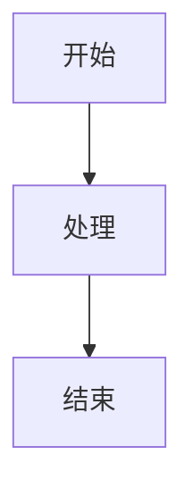

# <% tp.file.title %>

| 项目 | 内容 |
|------|------|
| 文档编号 | <% tp.file.cursor(1) %> |
| 版本 | V1.0 |
| 编制人 | <% tp.file.cursor(2) %> |
| 编制日期 | <% tp.date.now("YYYY-MM-DD") %> |
| 状态 | 草稿 |

---

## 1. 项目背景

### 1.1 业务现状

### 1.2 需求目标

---

## 2. 业务流程

---

## 3. 功能需求

### 3.1 功能点一

| 序号 | 校验项 | 校验规则 | 不通过处理 |
|------|--------|----------|------------|
| 1 | | | |

---

## 4. 非功能需求

### 4.1 性能要求

### 4.2 安全要求

---

## 5. 数据要求

参见：[[数据字典_核心业务字段说明]]

---

## 6. 验收标准

| 编号 | 验收项 | 验收标准 |
|------|--------|----------|
| AC-01 | | |

---

## 7. 关联文档

- 架构设计：[[保险核心系统技术架构设计]]
- 接口文档：[[投保核心系统API接口文档]]
- 数据模型：[[核心数据模型设计_ERD]]
