运营管理部保单业务查询、保全试算需求文档

修订记录

|  |  |  |  |
|----|----|----|----|
| 修订时间 | 修订说明 | 作者 | 版本 |
| 2026/3/30 | 初稿：查看保单状态信息、催办功能、试算功能 | Wiley Wang、Amy Ma3 | 1.0 |
| 2026/4/14 | 去除“白名单业务查询”，融入“保单业务查询” | Amy Ma3 | 1.3 |
| 2026/5/18 | 整理项目完整需求文档 | Amy Ma3 | 1.4 |
|  |  |  |  |
|  |  |  |  |
|  |  |  |  |
|  |  |  |  |
|  |  |  |  |

目录

> [1. 保单业务查询、保全试算入口需求-P0 [4](#保单业务查询保全试算入口需求-p0)](#保单业务查询保全试算入口需求-p0)
>
> [2. 保单查询、保全试算功能触发-P0 [4](#保单查询保全试算功能触发-p0)](#保单查询保全试算功能触发-p0)
>
> [3. 前端-保单查询、保单试算结果呈现-P0 [5](#前端-保单查询保单试算结果呈现-p0)](#前端-保单查询保单试算结果呈现-p0)
>
> [4. 前端-保单查询的催办功能实现-P0 [8](#前端-保单查询的催办功能实现-p0)](#前端-保单查询的催办功能实现-p0)
>
> [5. 后端-保单基础信息接收-P0 [9](#后端-保单基础信息接收-p0)](#后端-保单基础信息接收-p0)
>
> [6. 后端-基于用户的权限控制-P0 [10](#后端-基于用户的权限控制-p0)](#后端-基于用户的权限控制-p0)
>
> [7. 保单业务查询流程-P0 [13](#保单业务查询流程-p0)](#保单业务查询流程-p0)
>
> [8. 业务催办流程-P0 [16](#业务催办流程-p0)](#业务催办流程-p0)
>
> [9. 保单承保新单投递-P0 [19](#保单承保新单投递-p0)](#保单承保新单投递-p0)
>
> [10. 保全试算-P0 [20](#保全试算-p0)](#保全试算-p0)
>
> [11. 接口出入参数定义-P0 [22](#接口出入参数定义-p0)](#接口出入参数定义-p0)
>
> [12. 各业务工作人员排班表-P0 [22](#各业务工作人员排班表-p0)](#各业务工作人员排班表-p0)
>
> [13. 保单业务查询PC版-P0 [22](#保单业务查询pc版-p0)](#保单业务查询pc版-p0)
>
> [14. 保全试算PC版-P0 [22](#保全试算pc版-p0)](#保全试算pc版-p0)

## 1 保单业务查询、保全试算入口需求-P0

<table>
<colgroup>
<col style="width: 8%" />
<col style="width: 91%" />
</colgroup>
<thead>
<tr>
<th style="text-align: center;">需求场景</th>
<th>查询保单业务情况、保全试算</th>
</tr>
</thead>
<tbody>
<tr>
<td>流程图&amp;原型图</td>
<td><ol type="1">
<li>
i小诺【移动端】界面
</li>
</ol>

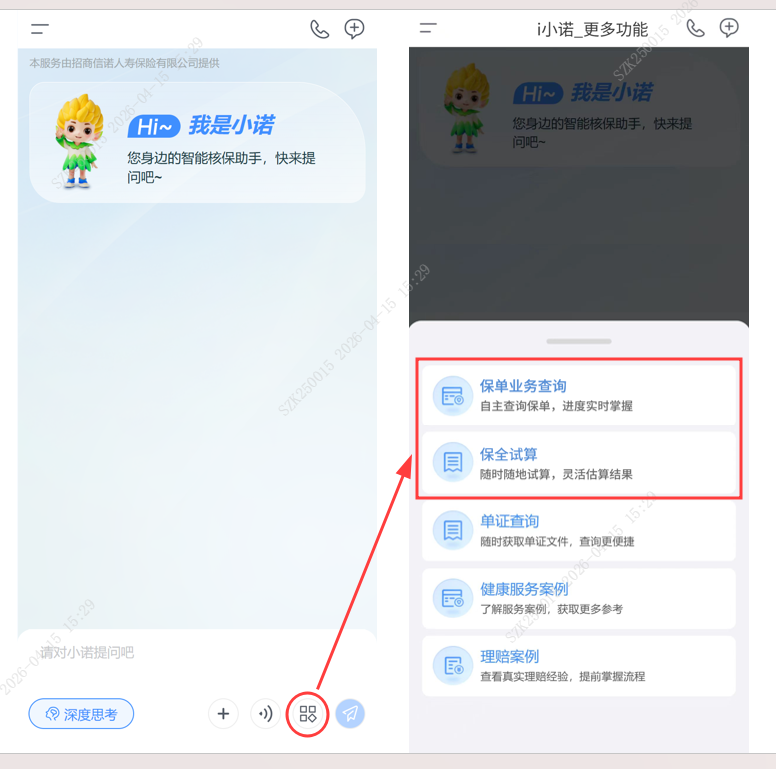
</td>
</tr>
<tr>
<td>功能描述</td>
<td><ul>
<li>
点击<strong>i小诺</strong>界面右下角的【更多：】后，增加“保单业务查询”、“保全试算”2个入口
</li>
<li>
同步在i小诺PC端的【更多功能】右侧和在新对话界面的【更多功能】添加相应入口
</li>
<li>
调整“更多功能“控件排序：<u>”保单业务查询“、”保全试算“、”单证查询“、”健康服务案例“、”理赔案例“</u>。（从左到右依次从上到下排列，如图）
</li>
</ul></td>
</tr>
</tbody>
</table>

## 2 保单查询、保全试算功能触发-P0

<table>
<colgroup>
<col style="width: 8%" />
<col style="width: 91%" />
</colgroup>
<thead>
<tr>
<th style="text-align: center;">需求场景</th>
<th>用户触发“保单查询”、“保全试算”后，界面的呈现方式</th>
</tr>
</thead>
<tbody>
<tr>
<td>流程图&amp;原型图</td>
<td><ol type="1">
<li>
i小诺【移动端】界面
</li>
</ol>
<table style="width:59%;">
<colgroup>
<col style="width: 29%" />
<col style="width: 29%" />
</colgroup>
<thead>
<tr>
<th style="text-align: center;">保单业务查询</th>
<th style="text-align: center;">保全试算</th>
</tr>
</thead>
<tbody>
<tr>
<td></td>
<td></td>
</tr>
</tbody>
</table></td>
</tr>
<tr>
<td>功能描述</td>
<td>
<strong>保单业务查询：</strong>

<ul>
<li>
在用户点击“更多功能”的【保单业务查询】功能时，进入保单查询流程，让用户提供“保单号/投保单号”
</li>
</ul>
<blockquote>

语句为：“请您提供要查询的单号(流水号/保单号/投保单号/预审保单号/预审投保单号）：”

</blockquote>
<ul>
<li>
用户发送“单号”后，通过查询返回保单业务查询结果。
</li>
</ul>

<strong>保单试算：</strong>

<ul>
<li>
在用户点击/提问到【保单试算】功能时，直接提供可选择的试算服务，
</li>
</ul>
<blockquote>

试算服务有：

试算：{退保试算，贷款试算，减额缴交清，复效试算}

保单利益查询：{红利查询，年金查询，生存金查询，万能账户查询}

</blockquote>
<ul>
<li>
用户点击对应【试算服务】后，提示用户输入【保单号】，并在用户发送保单号后，触发对应的试算功能，返回对应的试算结果。
</li>
</ul>
<blockquote>

语句为：“请提供您要试算的保单号，我将为您试算结果。”

</blockquote></td>
</tr>
</tbody>
</table>

## 3 前端-保单查询、保单试算结果呈现-P0

<table>
<colgroup>
<col style="width: 8%" />
<col style="width: 91%" />
</colgroup>
<thead>
<tr>
<th style="text-align: center;">需求场景</th>
<th>用户输入完整保单编号后，完成对应的保单业务查询、保全试算功能</th>
</tr>
</thead>
<tbody>
<tr>
<td>流程图&amp;原型图</td>
<td><ol type="1">
<li>
i小诺【移动端】界面

<ol type="1">
<li>
<strong>保单业务查询</strong>
</li>
</ol></li>
</ol>
<table style="width:60%;">
<colgroup>
<col style="width: 30%" />
<col style="width: 29%" />
</colgroup>
<thead>
<tr>
<th style="text-align: center;">查询正常</th>
<th style="text-align: center;">查询正常-均无内容</th>
</tr>
</thead>
<tbody>
<tr>
<td>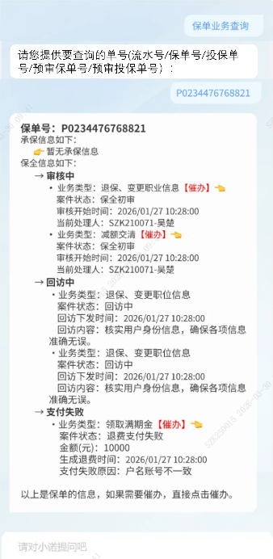</td>
<td></td>
</tr>
<tr>
<td>查询失败-无权限</td>
<td>查询失败-单号输入错误</td>
</tr>
<tr>
<td></td>
<td></td>
</tr>
</tbody>
</table>
<ol start="2" type="1">
<li>
<strong>保全试算</strong>
</li>
</ol>
<table style="width:60%;">
<colgroup>
<col style="width: 30%" />
<col style="width: 29%" />
</colgroup>
<thead>
<tr>
<th style="text-align: center;">试算正常</th>
<th style="text-align: center;">试算失败</th>
</tr>
</thead>
<tbody>
<tr>
<td>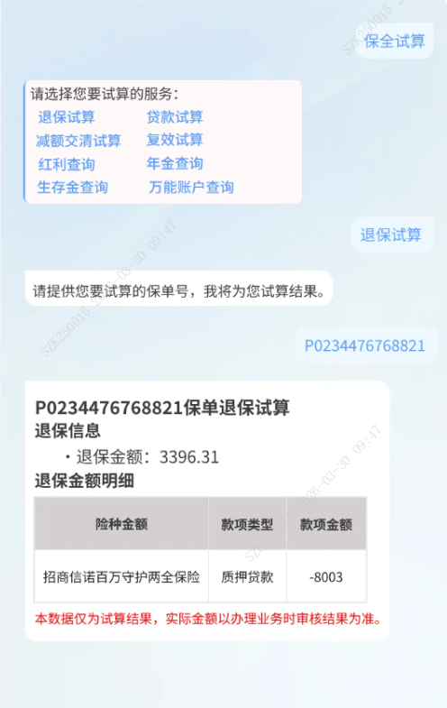</td>
<td></td>
</tr>
<tr>
<td>试算失败-无权限</td>
<td>试算失败-无保单信息</td>
</tr>
<tr>
<td></td>
<td></td>
</tr>
</tbody>
</table></td>
</tr>
<tr>
<td>功能描述</td>
<td>
输出形式：以卡片的形式进行呈现。

<strong>保单业务查询：</strong>

<ul>
<li>
通过用户输入的“单号”和用户的身份，根据接口返回的结果进行反馈。
</li>
</ul>
<ul>
<li>
用户<mark><strong>有</strong>权限</mark>-查询正常：
</li>
</ul>
<ul>
<li>
通过保单号，在验证用户权限和保单归属相匹配后，将保单的【承保信息】，【保全信息】进行呈现，针对可催办的业务，对【催办】做红色高亮显示，且可点击,“点击”后进入对应的催办流程。
</li>
</ul>
<ul>
<li>
用户<mark><strong>无</strong>权限</mark>：
</li>
</ul>
<ul>
<li>
通过保单号，验证用户权限不通过时，返回：“抱歉，您无权查询XX保单业务信息。”
</li>
</ul>
<ul>
<li>
用户<mark>输入错误单号</mark>（即非规则内单号/乱码）：
</li>
</ul>
<ul>
<li>
用户保单号没有查询到对应的保单信息，同时非规则内编码，则返回：“抱歉，未查到相关信息，请检查单号是否输入正确。“
</li>
</ul>

<strong>保全试算：</strong>

<ul>
<li>
通过用户输入的“保单号”和用户的身份，根据<mark>【保全试算接口】</mark>返回的结果进行回复。
</li>
</ul>
<ul>
<li>
用户<mark><strong>有</strong>权限</mark>试算：
</li>
</ul>
<blockquote>

在验证用户与保单间的权限通过后，直接把试算结果，在问答界面以“一问一答”的形式做呈现。

如果试算失败，也直接在界面以回复的形式回复用户试算失败原因。

</blockquote>
<ul>
<li>
用户<mark><strong>无</strong>权限</mark>：
</li>
</ul>
<blockquote>

如果用户与保单间的权限验证不通过，直接在问答界面回复：“抱歉，您无权试算XXX保单。”

</blockquote>
<ul>
<li>
用户<strong><mark>输入错误保单号</mark></strong>：
</li>
</ul>
<blockquote>

如果检索不到保单的基础信息，且保单号不在规则内，直接在问答界面回复：“抱歉，未查到相关信息，请检查保单号是否输入正确。”

</blockquote></td>
</tr>
</tbody>
</table>

## 4 前端-保单查询的催办功能实现-P0

<table>
<colgroup>
<col style="width: 8%" />
<col style="width: 91%" />
</colgroup>
<thead>
<tr>
<th style="text-align: center;">需求场景</th>
<th>用户在查询保单后，针对查询到的保单业务，存在可【催办】的业务，点击催办后的实现效果。</th>
</tr>
</thead>
<tbody>
<tr>
<td>流程图&amp;原型图</td>
<td>
【工作服务时间】的催办，根据业务定义逻辑，回复用户对应的语句，具体内容在表格中提供

非工作时间显示：已收到催办，会在工作时间及时处理！

注意：已催办过的内容，当前<mark>对话框</mark>不可再次催办。

1. i小诺【移动端】界面

<strong>催办：</strong>点击催办后，形成一问一答的回复模式，且催办按钮置灰操作，并不可再次点击

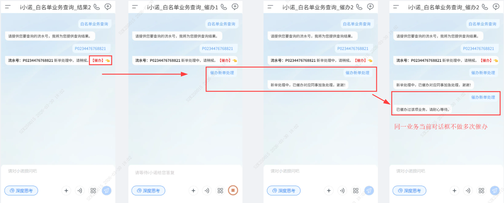

若用户在下方发起新的保单业务查询，前方咨询过的可催办业务显示不变，但是要限制点击，即去除前方查询业务的催办功能。

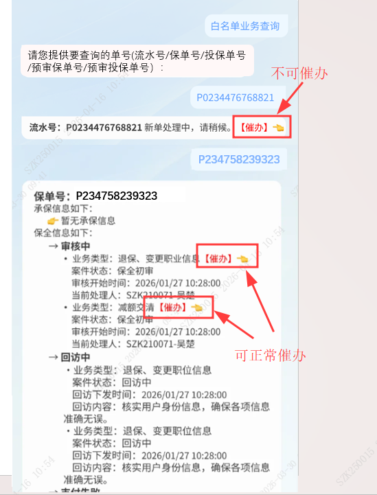
</td>
</tr>
<tr>
<td>功能描述</td>
<td><ul>
<li>
用户点击【催办】后，弹出提示框，显示“已催办：…(话术)”，具体话术根据<mark>业务表格</mark>进行匹配。
</li>
<li>
当前会话中，一个业务仅能催办一次。若用户新开会话查询，可再次催办。
</li>
<li>
若用户有多个保单业务查询，只支持最新一次保单业务的催办功能，前面的其他保单催办点击功能不生效。
</li>
</ul></td>
</tr>
</tbody>
</table>

## 5 后端-保单基础信息接收-P0

<table>
<colgroup>
<col style="width: 8%" />
<col style="width: 91%" />
</colgroup>
<thead>
<tr>
<th style="text-align: center;">需求场景</th>
<th>用户在【保单业务查询】、【保全试算】请求，提交“流水号/保单号/投保单号/预审保单号/预审投保单号”之后，需要检索获取保单的基础信息，用于后续与用户身份信息做验证，确保人与保单权限对应，保证保单信息的隐私性。</th>
</tr>
</thead>
<tbody>
<tr>
<td>流程图&amp;原型图</td>
<td>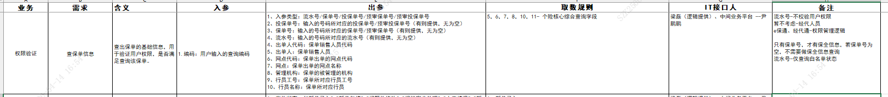</td>
</tr>
<tr>
<td>功能描述</td>
<td>
该内容的作用：

1.用于验证用户身份是否满足查询该保单

<mark>【调用“保单基础信息”接口】</mark>

2.用于规范后续查询流程中，统一为编号做【承保信息】【保全信息】获取

-- 注意：优先采用【保单号】进入后续业务查询流程，若无保单号，是投保单号，则进行【承保信息】获取，【保全信息】只能用保单号进行获取。

<ul>
<li>
流水号：对应白名单业务信息，调用
</li>
</ul>
<blockquote>

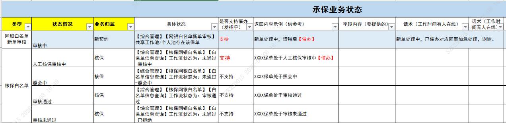

</blockquote>
<ul>
<li>
预审保单号/预审投保单号：对应预审单的业务信息
</li>
</ul>
<blockquote>

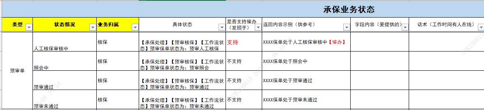

</blockquote>
<ul>
<li>
保单号/投保单号：对应除白名单、预审单的其他保单业务信息
</li>
</ul></td>
</tr>
</tbody>
</table>

## 6 后端-基于用户的权限控制-P0

<table>
<colgroup>
<col style="width: 8%" />
<col style="width: 91%" />
</colgroup>
<thead>
<tr>
<th style="text-align: center;">需求场景</th>
<th>根据用户的身份，所在部门，按照定义好的权限，来控制用户能否使用相应的【保单业务查询功能】、【保全试算功能】。确保人与保单的对应关系，保证保单信息的隐私性。</th>
</tr>
</thead>
<tbody>
<tr>
<td>流程图&amp;原型图</td>
<td>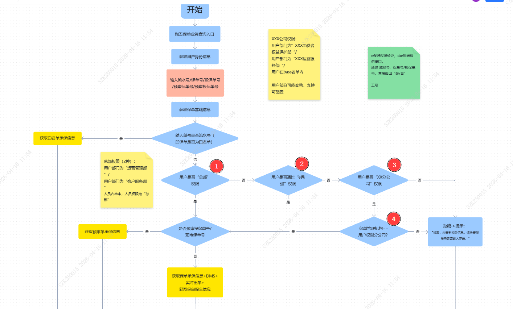</td>
</tr>
<tr>
<td>功能描述</td>
<td>
验证顺序为：总部🡪e保通🡪分公司

用户发起【保单业务查询】请求后，提供查询单号后，需根据规则（核心提供），分辨用户输入查询为流水号/预审投保单号/预审保单号/投保单号/保单号中的哪种编号，

1.流水号：不需要进行权限验证，直接查<mark>白名单接口</mark>信息即可

2.预审投保单号/预审保单号：需要做权限验证，验证通过后，获取<mark>预审单接口信息</mark>做呈现

3.投保单号/保单号：需要做权限认证，验证通过后，如果有保单号，后续查询以保单号做查询参数获取<mark>承保业务信息接口、投递-实时出单接口、投递-DMS信息接口、保全业务信息接口</mark>，做呈现。若无保单号，只有投保单号，则只获取<mark>承保业务信息接口</mark>做呈现。

4.非以上单号（乱码/错误单号）：在获取不到保单的基础信息时，默认单号错误，即无保单信息，直接做拒绝“抱歉，未查到相关信息，请检查单号是否输入正确。”

用户发起【保全试算】请求后，根据提供的保单号，需身份验证通过后，才可调用<mark>保全试算接口</mark>

为方便后期维护，总部部门权限和分公司部门权限使用表格进行维护。

<mark>权限配备表模板：</mark>

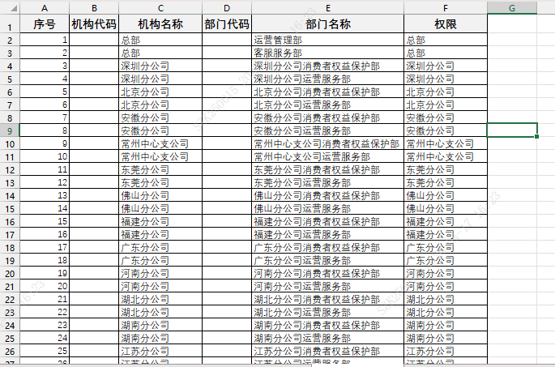

<mark>单人员权限名单模板：</mark>

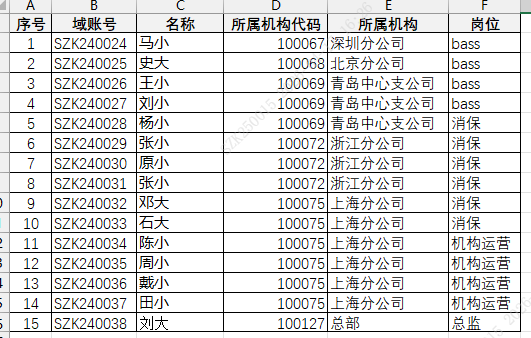
</td>
</tr>
<tr>
<td>
权限

控制

维度
</td>
<td><ol type="1">
<li>
用户身份为【总部】则可以直接通过身份验证，查询保单业务、试算保全
</li>
<li>
用户身份为【销售】、【IA】，根据e保通中，用户与保单的规则，确定身份验证是否通过。保单号/投保单号/预审保单号/预审投保单号，权限判断规则统一。【由e保通业务团队支持】调用<mark>【e保通权限接口】</mark>
</li>
<li>
用户身份为【XX分公司】则可以查该用户所任职的【分公司保单】，如果用户输入的保单非该分公司负责保单，则身份验证不通过。除前面3种身份外的其他【公司员工】，拒绝查询任何保单信息，身份验证都不通过。
</li>
</ol>

只有身份验证通过，才能提供保单信息、保单试算。验证不通过直接做拒绝处理。

<table style="width:90%;">
<colgroup>
<col style="width: 19%" />
<col style="width: 70%" />
</colgroup>
<thead>
<tr>
<th style="text-align: center;"><strong>权限级别</strong></th>
<th style="text-align: center;"><strong>授权人员</strong></th>
</tr>
</thead>
<tbody>
<tr>
<td style="text-align: center;">总部</td>
<td><ul>
<li>
部门：“总部-运营管理部”、“总部-客户服务部”（用<mark>权限配备表</mark>进行总部部门配置，便于后续更改）
</li>
<li>
人员名单中，权限为【总部】的人员（用<mark>单人员权限名单</mark>进行配备）
</li>
</ul></td>
</tr>
<tr>
<td>XX分公司</td>
<td><ul>
<li>
部门：“XX分公司-XXX消费者权益保护部”、“XX分公司-XXX运营服务部” （用<mark>权限配备表</mark>进行总部部门配置，便于后续更改）
</li>
<li>
人员名单中，权限为【XX分公司】的人员（用<mark>单人员权限名单</mark>进行配备）
</li>
</ul></td>
</tr>
<tr>
<td>销售、IA</td>
<td><ul>
<li>
由e保通根据业务规则判定人员权限
</li>
</ul></td>
</tr>
</tbody>
</table>

注意：此处有读取上传名单，获取权限并做比较的功能点（人员名单，需要上传到知识库）
</td>
</tr>
</tbody>
</table>

## 7 保单业务查询流程-P0

<table>
<colgroup>
<col style="width: 8%" />
<col style="width: 91%" />
</colgroup>
<thead>
<tr>
<th style="text-align: center;">需求场景</th>
<th>用户触发【保单业务查询】时，从身份验证到结果呈现再到催办的完整流程。</th>
</tr>
</thead>
<tbody>
<tr>
<td>流程图&amp;原型图</td>
<td>
<strong>1.查询流程</strong>

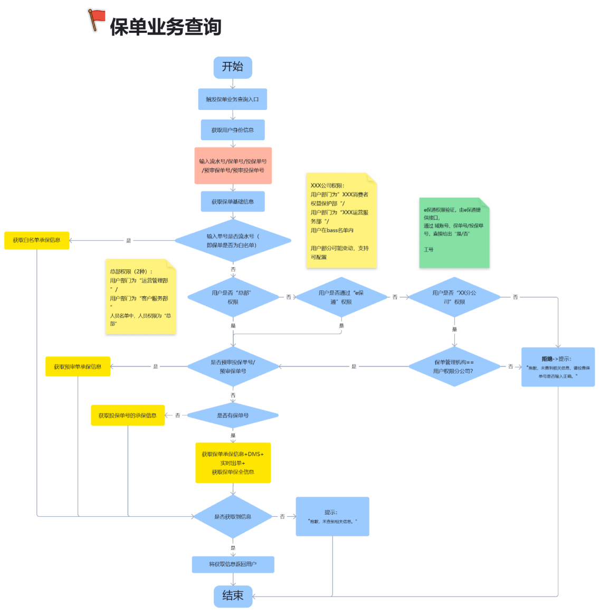

<strong>2.催办流程：</strong>

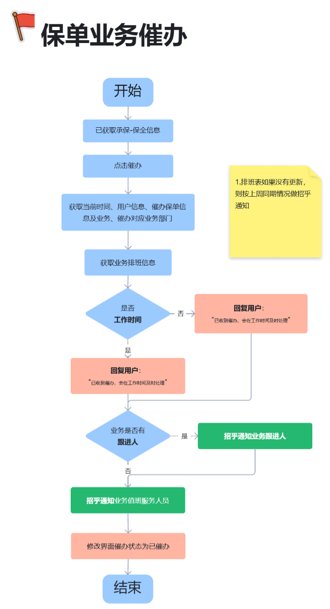
</td>
</tr>
<tr>
<td>功能描述</td>
<td>
1.在用户触发【保单业务查询】后，向用户获取到查询“流水号/保单号/投保单号/预审保单号/预审投保单号”后，

-- 根据编号规则（核心提供），辨别编号属于哪种类型后，查询对应的业务

== 流水号对应<strong>白名单</strong>（网银白名单新单审核、核保白名单）【调用<mark>白名单业务信息</mark>接口】

== 预审投保单号/预审保单号对应<strong>预审单</strong>【调用<mark>预审单承保信息</mark>接口】

以上两种单，都没有保全信息，不需要对保全信息进行获取

== 投保单号【调用<mark>承保业务信息</mark>接口】

== 保单号【调用<mark>承保业务信息</mark>+<mark>保全业务信息</mark>接口】

2.需要获取该【单号】的保单基础信息、用户的基础信息（域账号、用户名称、部门等）

<ul>
<li>
【保单信息】与【用户信息】按照用户权限规则[6.后端-基于用户的权限控制]进行比对，确保该用户具备保单权限，才进行保单业务信息提供。（流水号除外，流水号都可查）
</li>
<li>
通过身份验证后，针对保单状态的信息呈现，按照业务定制状态进行排版显示
</li>
</ul>

3.在查询结果呈现后，针对业务确定的部分业务状态可做催办功能。若用户点击了【催办】，则进入催办流程。

注意：一个会话中，单个状态只能催办一次，点击过后，催办按钮置灰切换成已催办状态，不可再点击。

<strong>业务状态呈现及可催办内容：</strong>

<strong>承保信息：</strong>

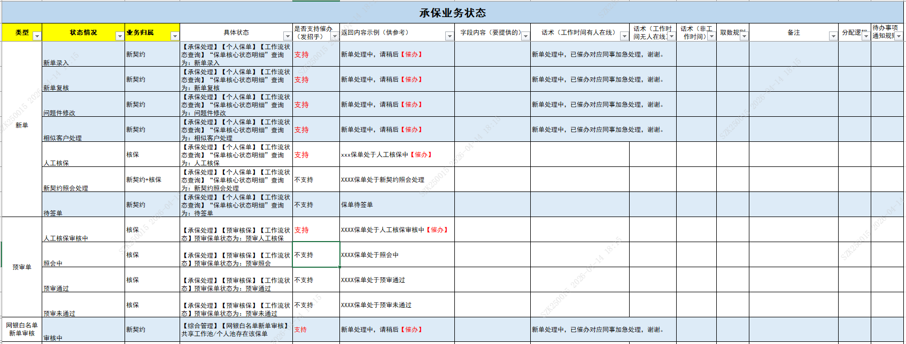

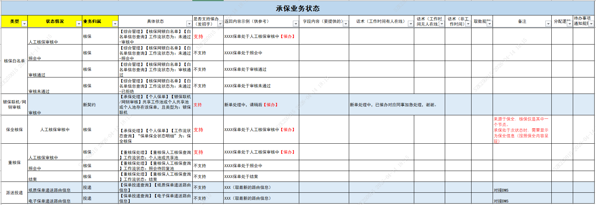

派送投递内容的呈现详情，查看“<strong>保单承保新单投递</strong>”模块

<strong>保全信息：（保全业务团队）</strong>

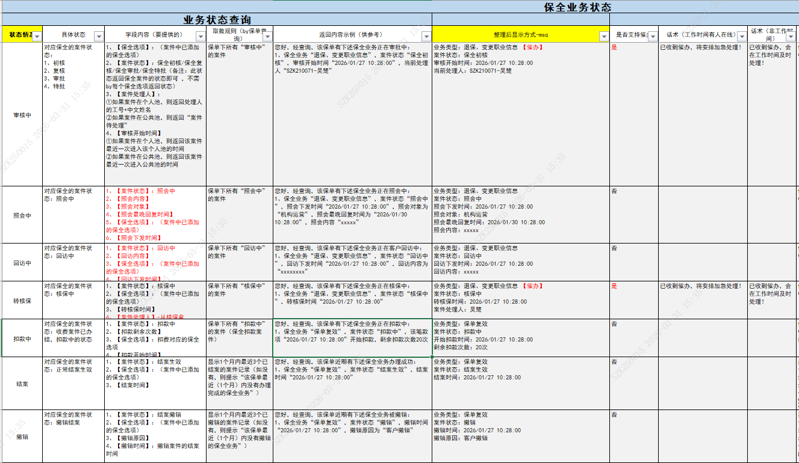

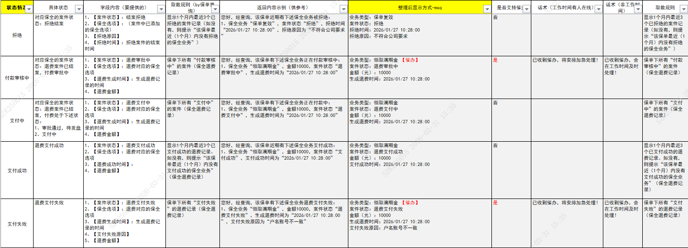

注意：如果保全的某个状态下，没有记录时，该状态不在界面进行显示。

若所有的状态均无信息，则显示：“暂无保全信息。”
</td>
</tr>
</tbody>
</table>

## 8 业务催办流程-P0

<table>
<colgroup>
<col style="width: 8%" />
<col style="width: 91%" />
</colgroup>
<thead>
<tr>
<th style="text-align: center;">需求场景</th>
<th>用户在查询到的【保单状态信息】时，存在支持催办的业务，当用户点击【催办】时，触发【催办】流程。</th>
</tr>
</thead>
<tbody>
<tr>
<td>流程图&amp;原型图</td>
<td></td>
</tr>
<tr>
<td>功能描述</td>
<td>
当用户点击催办时，当前保单查询内容中，一个业务只支持催办点击一次

1.查询后直接催办

用户初次点击催办时，通过业务信息的内容，做以下操作：

1）回复用户“已催办，。。。”的语句，根据是否工作时间变动。

2）招乎通知该业务跟进人（如果有跟进人的话）

3）招乎在业务团队群里，通知对应的值班人员。

4）界面已催办业务的显示要从催办切换到已催办的状态。

<strong>保单处于【<mark>承保/保全</mark>】流程中，且用户点击了“催办”：</strong>

根据定义的规则进行催办处理：

存在以下情况：

<ol type="1">
<li>
<strong>非工作时间：</strong>在非正常服务时间内容，根据话术回复“已收到催办，会在工作时间及时处理！”
</li>
<li>
<strong>工作时间：</strong>根据话术回复催办用户：<strong>“</strong>已收到催办，将安排加急处理！”
</li>
</ol>

内部消息通知：

案件<strong>有跟进人</strong>时（根据问题的归属业务板块通知不同团队的服务人员）：

1）招乎提醒跟进人员 + 业务服务人员

案件<strong>无跟进人</strong>时（根据问题的归属业务板块通知不同团队的服务人员）：

1）招乎提醒服务人员

以上提到的“服务人员”根据用户点击的催办业务类型，统一通知对应的业务团队人员（业务及业务团队人员名单待提供配置【上传到知识库】）

1. 业务团队排班表格模板：

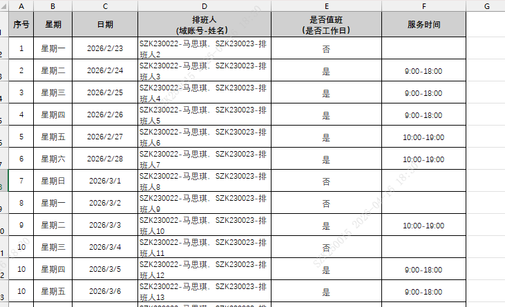
</td>
</tr>
</tbody>
</table>

## 9 保单承保新单投递-P0

<table>
<colgroup>
<col style="width: 8%" />
<col style="width: 91%" />
</colgroup>
<thead>
<tr>
<th style="text-align: center;">需求场景</th>
<th>保单业务查询中，保单的投递情况呈现详情</th>
</tr>
</thead>
<tbody>
<tr>
<td>流程图&amp;原型图</td>
<td>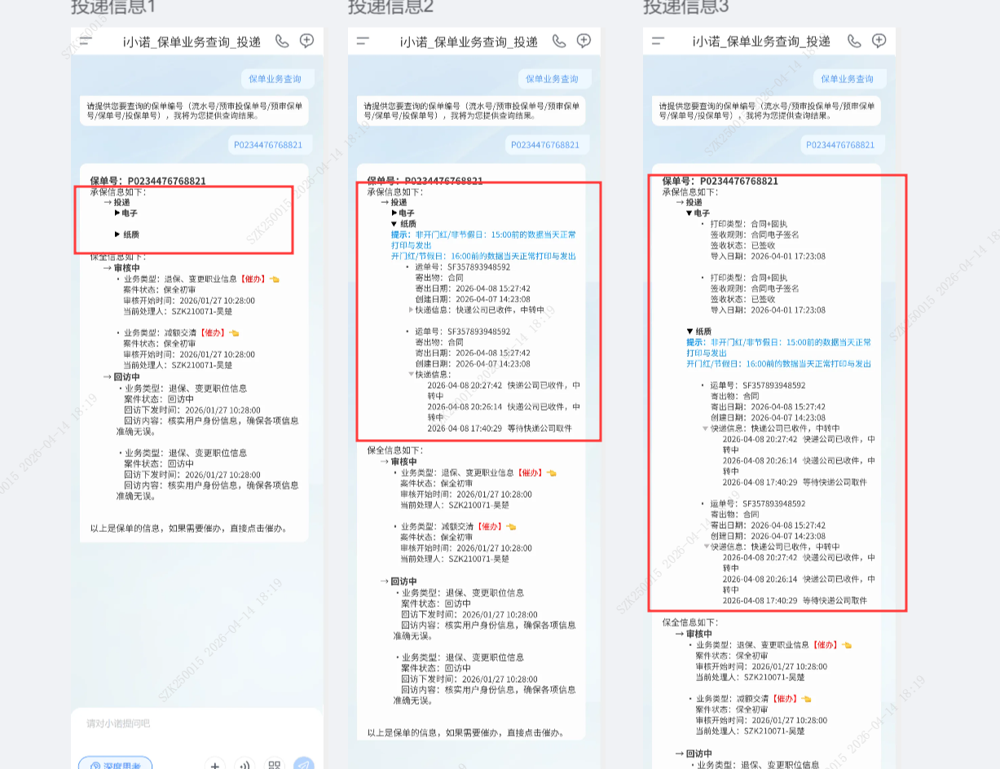</td>
</tr>
<tr>
<td>功能描述</td>
<td>
保单投递功能分为：<strong>电子</strong>和<strong>纸质</strong> 2个内容项（可折叠、收缩）

注意：若以下内容均为空，则不显示投递模块内容

1.电子：

-根据保单号，获取该保单的“打印类型”、“签收规则”、“签收状态”、“导入日期”

（内容获取参照“实时出单”平台，仅显示近<u>6个月</u>的记录）

显示内容按照“导入日期”进行倒序排列

- 保全电子信函暂不纳入本次需求范围，只提供保单/投保单/回执相关的电子单发送信息

2.纸质：

- 根据保单号，获取该保单的“运单号”、“寄出物”、“寄出日期”、“快递信息（路由信息）”、“创建日期”（不做显示，仅用于显示排序）

显示内容按照“创建日期”进行倒序排列

（内容获取参照“DMS”平台，仅显示近<u>6个月</u>的记录）

<strong>注意：</strong>针对纸质投递的内容呈现，在最开始放置固定提示语句：“非开门红或节假日：15:00前的数据会在当天正常打印与发出”和“开门红或节假日：16:00前的数据会在当天正常打印与发出”

<ul>
<li>
快递信息（路由信息）按照时间进行罗列呈现，统一进行倒序排列
</li>
</ul></td>
</tr>
</tbody>
</table>

## 10 保全试算-P0

<table>
<colgroup>
<col style="width: 8%" />
<col style="width: 91%" />
</colgroup>
<thead>
<tr>
<th style="text-align: center;">需求场景</th>
<th>通过用户提供的保单号，进行权限验证后，从接口中，获取保单的保全试算结果。</th>
</tr>
</thead>
<tbody>
<tr>
<td>流程图&amp;原型图</td>
<td>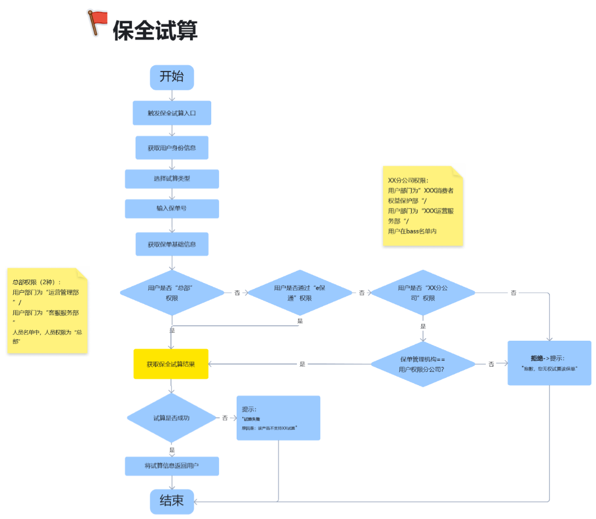</td>
</tr>
<tr>
<td>功能描述</td>
<td>
1.接收保单号后，根据[6.后端-基于用户的权限控制]进行权限验证，验证通过后，才调用<mark>【保全试算接口】</mark>，获取试算结果后进行呈现。

<mark>【保全试算接口】</mark>传输2个参数：保单号、试算类型，具体看接口文件。

2.保全试算结果有4种情况：

1）保单号输入错误

在通过【保单基础信息接口】时，无法获取到保单的基础信息时，则认为该保单号错误，直接做拒绝：“抱歉，未查到相关信息，请检查单号是否输入正确。”

2）无权限

在提取到保单基础信息后，根据[6.后端-基于用户的权限控制]进行权限验证不通过时，直接拒绝：“抱歉，您无权查询XX保单业务信息。”。

3）试算失败

通过<mark>【保全试算接口】</mark>获取保单试算结果后，试算结果为失败，则直接将失败原因呈现给用户。失败原因通过接口抓取并呈现。

4）试算成功

通过向<mark>【保全试算接口】</mark>获取保单试算结果，并做整理后，供前端呈现。

<table style="width:89%;">
<colgroup>
<col style="width: 22%" />
<col style="width: 22%" />
<col style="width: 22%" />
<col style="width: 22%" />
</colgroup>
<thead>
<tr>
<th>退保试算</th>
<th>贷款试算</th>
<th>减额交清试算</th>
<th>复效试算</th>
</tr>
</thead>
<tbody>
<tr>
<td>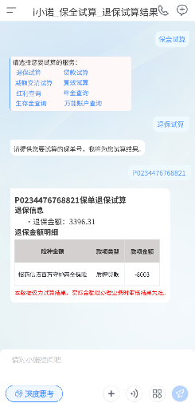</td>
<td>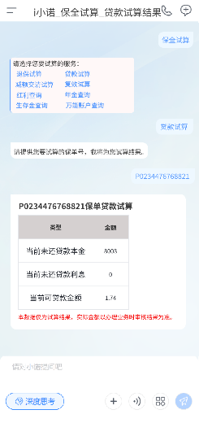</td>
<td>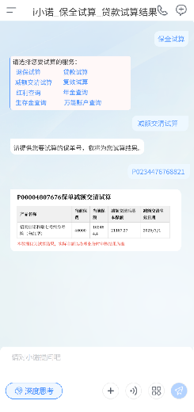</td>
<td>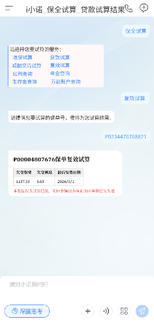</td>
</tr>
<tr>
<td>红利查询</td>
<td>生存金查询</td>
<td>年金查询</td>
<td>万能账户查询</td>
</tr>
<tr>
<td>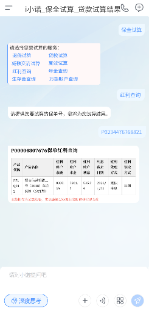</td>
<td>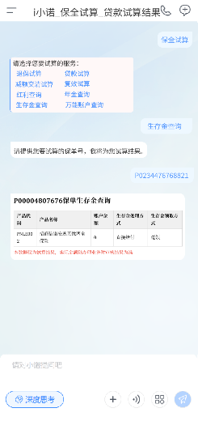</td>
<td>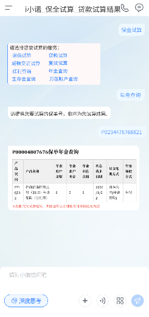</td>
<td>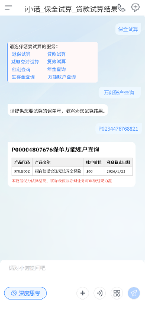</td>
</tr>
</tbody>
</table></td>
</tr>
</tbody>
</table>

## 11 接口出入参数定义-P0

## 12 各业务工作人员排班表-P0

> 上传到知识库指定路径下
>
> 有3个业务团队排班表：新契约、核保、保全，每个业务团队的排班时间不一致，需要区分开。
>
> 针对业务上传的排版表，在表格记录的最后2天，招乎通知表格上传人员，更新排班表。

## 13 保单业务查询PC版-P0

> 相同业务逻辑，同步在i小诺PC版添加保单业务查询功能。

## 14 保全试算PC版-P0

> 相同业务逻辑，同步在i小诺PC版添加保全试算功能。
