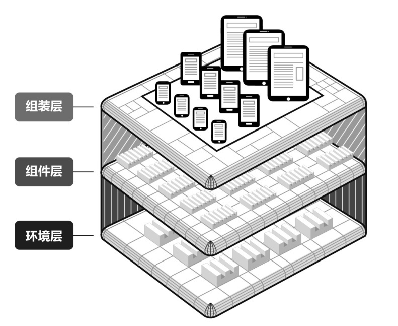
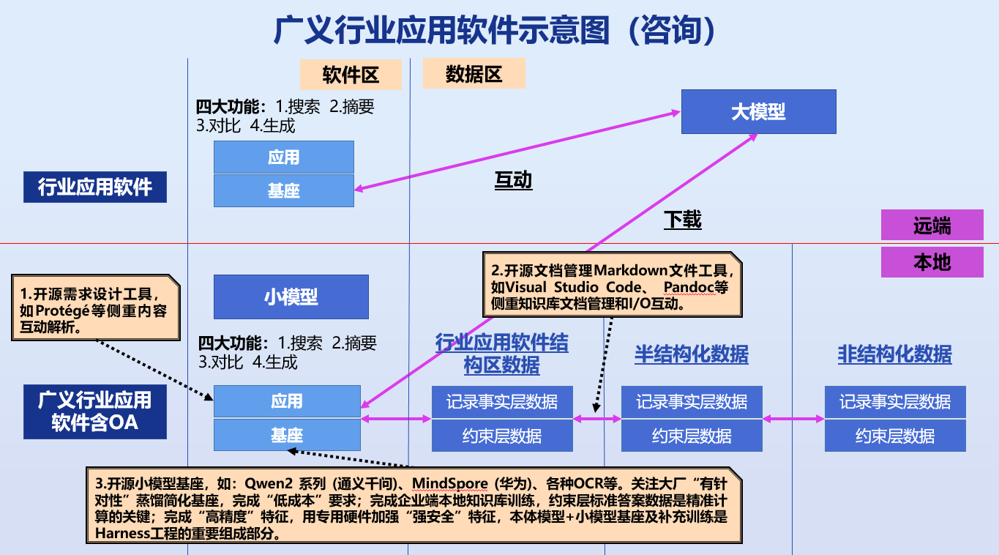

**中科软科技股份有限公司**

**“软件交互式需求设计开源软件工具和平台建立及组织协同实施”**

**研发专题比赛方案**

**一、活动目标**

“开源平台及编程”系列专题比赛是中科软特色“技术交流”的新主体，许多年过去了，系统集成的含义发生了巨大变化，很多事业部/群有了新的发展，新的基础服务要了解公司的技术水平和技术交流文化，事业群和事业部需要进行横向交流。为此，公司将以“**<u>软件交互式需求设计开源软件工具和平台建立及组织协同实施</u>**”为命题进行一次方案辩论比赛，通过比赛，期望达到如下目的：

1.  可以展示我们在**<u>软件交互式需求设计开源软件工具和平台建立及组织协同实施</u>**进行行业应用系统开发所取得的成果。

2.  增进技术咨询交流、提高在行业应用中运用开源技术的水平。

3.  提高辩论的水平和能力。

4.  促进团队荣誉感，增强团队的合作能力。

届时将邀请包括专业媒体、软件所、行业领域的相关专家做评委，通过此项活动展示我们公司技术实力的同时，也为年底软件技术大会的新主题起到一定的推动作用；同时，邀请有关专家介绍有关开源平台目前的发展现状和趋势，并进行评审专家点评，使这次比赛的真实价值得以提升。

**二、实施机构与职责**

**<u>“软件交互式需求设计开源软件工具和平台建立及组织协同实施”</u>**研发专题比赛由技术委员会、人力资源部、办公室、质量管理部共同组织实施。

\*技术委员会职责：

1.  负责拟写技术专题比赛计划草案。

2.  负责技术专题比赛会议纪要撰写工作。

3.  负责参与技术专题比赛评审组组建工作。

4.  负责技术专题比赛的经费审批。

\*人力资源部职责：

1.  负责编写技术专题比赛实施方案。

2.  负责拟写并发布技术专题比赛通知。

3.  负责技术专题比赛文档的收集工作。

4.  负责参与技术专题比赛评审组成员的联络工作，以确保评审专家按时参加。

5.  负责技术专题比赛准备、组织实施工作。

6.  负责技术专题比赛成果归档工作。

\*办公室

1.  负责技术专题比赛会场预订工作。

2.  负责协助人力资源部组织参赛人员、参会人员准时到场。

\*质量管理部

1.  负责参赛技术文档备案管理，作为CMMI、ISO的细化文件。

2.  负责根据参赛技术文档内容核对标杆项目的文档体系。

**三、比赛规则**

（一）比赛方式

比赛分为：文档评审、辩论比赛（预赛、决赛）、专家点评三部分进行。

（二）报名要求

本次比赛按各事业群，以团队形式报名，每个参赛队由3人组成，最好也是该部分的负责人，最终由公司领导及各事业部/群主管领导协商确定6个参赛队。

（三）比赛议程安排

1.  提交文档及专家对文档进行评审

2.  辩论预赛

3.  软件所专家介绍软件交互式需求设计开源软件工具和平台建立目前的研究现状及发展趋势

4.  辩论决赛

5.  评审专家点评

3.1文档内容要求与文档评审

- **文档概括要求**

用图示方法说明参赛**<u>软件交互式需求设计开源软件工具和平台建立</u>**整体软件体系结构图中的位置和软件交互式需求设计开源软件工具和平台建立本身的结构图。区分：1.环境结构图。2.内部组成结构图。其中，环境结构图说明本开源软件在行业应用软件结构图的位置，特别强调与已有行业应用软件<u>组装层</u>软件的关系。在内部组成结构图中，要说明本开源软件的体系结构及结构之间的相互关系，功能特点等。

**行业应用软件解决方案示意图**

**图1**

叙述的方式可以是先软件交互式需求设计开源软件工具和平台建立内容后协同实施，用示意图表示，给出具体开源软件内容的<u>总体图和详细图</u>，并且图和图之间要有明确的对应关系，如可以把开源软件的体系结构划分的更详细，由于在开源社区的文档里相对零散，最好进行完整表述，有特点的补充可以形成新的、独创的开源软件“技术白皮书”。

在介绍开源软件内容方面可以衔接历次比赛相关内容，特别是突出前几年比赛的<u>“参考系统模型平台”</u>，涉及系统集成综合服务相关内容，这样使方案内容更加完整和持续，使系统软件与应用软件有较好的衔接，特别是对应用编程“有感”的开源软件。

- **解决方案内容包括**

本次比赛集成解决方案内容部分，采用业内常见的“订阅服务”内容，简要回答如下列出的各项内容。

（一）总体概述

**注：**

1.  **在众多开源软件中，选择主要流行开源软件作为比赛的重点介绍。**

2.  **关注核心应用加文案处理场景。**

3.  **关注升级工程化数据标注和文档管理，包括交互式可视化需求设计、半结构化文案数据管理和小模型基座的选择和微调。主要由于领域知识强相关，易发挥ISV优势，形成新的驾驭工程方法论和最佳实践。**

对以下各点的总结归纳、直接归纳或强调以下方面：本开源软件/产品群的功能和特色、结构图及分层策略、精准度评价、自有成功案例、工程化水平、技术水平、工具和平台、集成预案、综合能力...

（二）体系结构

介绍本开源软件/产品的体系结构，分块特点及相互关系，主要功能和特点适应场景，以及同类软件和产品的主要内容对比和优/劣势分析、市场状况、应用第三方改进，及其工程适配等内容。

（三）技术服务内容

介绍各开源软件/产品的最新版本，推荐使用版本，测试服务级别，常见问题及解决方案等，计划与已有本事业群应用软件集成和打包服务方案。

（四）订阅服务的内容及效果（可参考红帽的相关文档）

订阅服务指南，服务保障范围，人员服务水平和认证，定价方式，扩展性配置，二次开发内容和服务，已有工程实践效果等。

（五）协同实施内容包括

针对上节给出的开源软件订阅服务和成果物，以及各种支撑环境，给出事业群内的组织总体协同机制，并针对内容和成果物，其中重点结合自己的行业（具体可给出例子）。

最好与已有成果物，如<u>参考模型</u>、<u>样本程序</u>、<u>编码规范</u>、<u>词根表和数据字典</u>、<u>蓝图数据结构</u>等产生关联，强调自身的价值。由于安全和内容质量要求，需要建立类似维基百科机制。有训练者（贡献者）资质，编辑评审，运行维护等机制。

特别强调使用中的“常见问题”（坑），强调已有成果的方法论，如何在数据结构、过程管理等方面形成“关注点”。注意模型使用的安全性，及约束性使用方法。

特别交流知识库实践培训上岗情况和开源工具使用效果。详细讨论开源订阅业务及知识工程体系订阅服务，以及它们的协同机制。特别强调使用开源工具进行实时监控，发现问题及改进的方案！

包括：团队的组织、各方责任分工、分层集成分工、地域性相互协同机制、“做庄”和“领导”的关系、成本的核算机制、PMO和NGO方式、用户方的认可方式，列出系列成果物和相关文档（结合系统集成和云服务方法论）。

给出典型的协同案列（最好给出具体的用户场景，结合具体用户的要求），也可举例说明<u>协同的原理</u>、<u>用户的需求</u>、<u>两端的组织人员机制</u>、<u>总规模</u>、<u>完成用户任务的特点</u>、<u>内部相互协作的要点</u>、<u>相互核算的机制</u>、<u>用户合同条款的关联</u>、<u>运行结束后的效果</u>、<u>与传统方法对比的优点</u>、<u>现场系统安全和数据安全规则和措施</u>......

- **已有的成绩和未来发展**

针对以上各节的内容，总结已有的成绩，包括<u>方案内容</u>的<u>协同实施</u>、<u>总规模</u>、<u>互动效果</u>、<u>已有成果汇总</u>、<u>用户的认可信息</u>。

给出近一时期的<u>新的发展重点</u>、<u>预计短期内达到的目标</u>、<u>公司范围合作的建议</u>......

3.2辩论预赛

主持人：

①以抽签的形式确定比赛小组与比赛顺序，即：A组（A1、A2）、B组（B1、

B2）、C组（C1、C2）。

②每组比赛要求：

A、参赛队按照比赛顺序，分别介绍自己的具体方案（PPT文件），每队用时 10 min（9 min时提醒一次）。（标号为“1”的队先介绍）

B、辩论（辩论进程由主持人控制执行）10 min。

陈词阶段：先由评委提问，“1”队进行陈述回答；再由评委提问，“2”队进行陈述回答。（要求：评委每次只能提问一个到两个问题，回答问题的时间不得超过3min。）

辩论阶段：各队可针对对方陈词阶段所回答的问题提出简单建议，由评委进行提问，对方简单回答，新的问题进行辩论。

③评委打分：下组队员上台做准备。

④预赛总用时：每组30 min，3组共计用时不超过90 min。

⑤评分结果应用。

预赛中，辩论与案例文档按权重得出的分值之和为总得分，名列前两名的，参加决赛。参加决赛的队伍，抽签决定发言顺序。

3.3评委介绍软件交互式需求设计开源软件工具和平台建立目前的研究现状及发展趋势

3.4辩论决赛

①以抽签的形式确定发言顺序。

②比赛要求：

A、参加决赛的参赛队分别对原文件进行总结（PPT文件），每队用时5 min （4 min时提醒一次）。

B、辩论（辩论进程由主持人控制执行）（评委先提问）用时10 min 。

陈词阶段：抽到“2”的队先提问，建议将问题给评委，再由评委提问，“1”队进行陈述回答；再由“1”队提问，建议将问题给评委，再由评委提问，“2”队进行陈述回答。（要求：评委每次只能提问一个问题，回答问题的时间不得超过3min。）

C、各队总结发言，每队用时2 min。

③评委打分。

④决赛总用时：预计不超过60 min。

3.5评委组点评

评委组进行总体点评，预计用时不超过30min。

**四、评审规则**

（一）评委组成

本次比赛评委人数以实际到场人数为准，评委由下列人员组成：

外请专家（名单于比赛当日通报）

技术委员会负责人

其他由公司领导指定人员

（二）评分办法

评委通过评分表（见附件）的形式给参赛队打分，人力资源部负责现场计算分值。

（三）评分公式

每队总得分 = 所有评委评分的平均值（去掉一个最高分、去掉一个最低分）

（四）评分因素

1.  文档内容评分因素

①文档内容的完整性（不用包括过多细节），包括必要的实际领域案例及参考文献。

②结构的合理性，易理解和易掌握性，文档装订美观。

③突出方案框架的先进性和创新性。

④实际运用中的效果。

2.  辩论评分因素

①方案的水平。

②方案的实用性和效果。

③方案的表达、概括能力。

④辩论技巧与效果。

⑤团队合作、配合能力。

⑥举止言表。

（五）评分权重

1.  案例文档评分占总分值的30%，现场辩论评分占总分值的70%。

2.  辩论比赛预赛与案例文档按权重得出的平均分值之和为总得分，名列前两名的，取得决赛权资格，争冠亚军。

3.  辩论比赛决赛分值高的一方为获胜方，案例文档分值将不再计入分值中。

（六）评分结果应用

辩论比赛决赛中，获得高分的一队为冠军，另一队为亚军。

**五、活动里程碑时间**

1.  发布通知时间：2026年4月28日

2.  报名时间：2026年4月28日至2026年4月30日

3.  报名地点：人力资源部，报名表见附件

4.  参赛资格审核时间：2026年4月28日至2026年4月30日

5.  确定参赛人选时间：2026年4月30日

6.  发送比赛通知时间：2026年4月30日

7.  赛前讲解时间：2026年4月28日左右（主讲人：左春，具体时间以通知为准，请在讲解时确定所选开源项目）

8.  提交案例文档及参赛演示电子文档（PPT）时间：2026年5月15日以前

9.  报人力资源部

电子材料申报邮箱：menyue@sinosoft.com.cn

10. 案例文档评分时间：待定

11. 预计比赛时间：待定

12. 比赛地点：待定

**六、奖励**

1.  本次比赛获得冠军的，颁发“技术竞赛冠军”奖杯、冠军荣誉证书，奖金1000元。

2.  本次比赛获得亚军的，颁发亚军荣誉证书，奖金800元。
